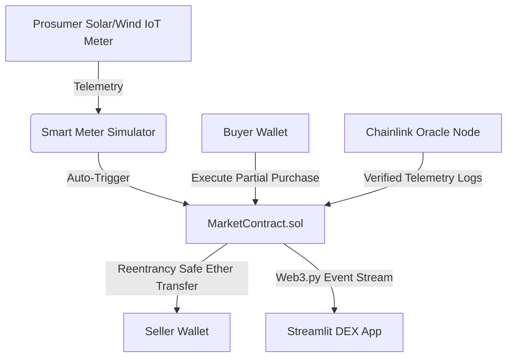

# ⚡ Peer-to-Peer Energy Trading Blockchain & Streamlit DEX

<a href="https://energy-trading-blockchain.streamlit.app/" target="_blank" rel="noopener noreferrer"></a>
[](https://soliditylang.org/)
[](https://chain.link/)
[](https://web3py.readthedocs.io/)

A decentralized Peer-to-Peer (P2P) energy trading platform that empowers prosumers (producers + consumers) to trade surplus renewable energy (Solar, Wind, Biomass) directly over an Ethereum microgrid using smart contracts, real-time IoT smart meter telemetry, and interactive Streamlit analytics.

👉 **Live Demo:** <a href="https://energy-trading-blockchain.streamlit.app/" target="_blank" rel="noopener noreferrer">https://energy-trading-blockchain.streamlit.app/</a>


---

## 🚀 App Features

* **⚡ Decentralized Microgrid Trading:** Direct prosumer-to-consumer P2P trading without intermediary utility fees.
* **🛡️ Secure Smart Contracts:** `MarketContract.sol` with `ReentrancyGuard`, partial-fill order execution, and safe ETH/ERC-20 token settlements.
* **📊 Interactive Streamlit DEX Dashboard:** Crisp Light Mode UI featuring active orderbook management, listing creation, and live transaction ledgers.
* **☀️ Smart Meter Telemetry Simulator:** Real-time IoT generation vs. consumption sliders with automated smart-contract listing triggers.
* **📈 Rich P2P Analytics:** Interactive Plotly visual charts tracking volume distributions, pricing trends, and past settlement history.
* **🔗 Chainlink Oracles:** Integrated decentralized ETH/USD price feeds and verified off-chain smart meter audit logs.

---

## 🏗️ Architecture & Workflows



---

## 📋 Project Summary

### 🎯 Key Objectives
1. **Assessment of Blockchain's Feasibility:** Evaluate the suitability of Ethereum smart contracts in facilitating transparent, tamper-proof, and secure peer-to-peer energy trading in decentralized microgrids.
2. **Decentralization Impact:** Analyze how peer-to-peer networks eliminate utility intermediaries, reducing transaction fees and improving green energy accessibility.
3. **Smart Contract Architecture:** Implement secure Solidity contracts (`MarketContract.sol`, `EnergySwapToken.sol`, `UserContract.sol`, `EnergyDataContract.sol`) for automated execution, reentrancy-safe payments, and partial order fills.

---

## 💻 Tech Stack

- **Smart Contracts:** Solidity `^0.8.0`, OpenZeppelin Security Standards (`ReentrancyGuard`, `ERC20`).
- **Blockchain Framework:** Truffle / Hardhat / Ganache local node integration.
- **Frontend Dashboard:** Python 3.10+, Streamlit, Plotly, Pandas.
- **Web3 Connector:** `web3.py` client library for EVM network RPC calls.

---

## ⚙️ Getting Started

### Quick Start (One-Click Launcher)

Run the included automated setup script to set up virtual environments, install dependencies, and launch the Streamlit app locally:

```bash
chmod +x setup.sh
./setup.sh
```

### Manual Local Setup

1. **Clone the Repository:**
   ```bash
   git clone https://github.com/surupi/Energy_Trading_Blockchain.git
   cd Energy_Trading_Blockchain
   ```

2. **Set Up Python Virtual Environment:**
   ```bash
   python3 -m venv venv
   source venv/bin/activate
   pip install -r requirements.txt
   ```

3. **Launch Streamlit Dashboard:**
   ```bash
   cd streamlit_app
   streamlit run app.py
   ```
   Open `http://localhost:8501` in your browser.

---

## 📁 Repository Structure

```
Energy_Trading_Blockchain/
├── backend/
│   └── contracts/
│       ├── EnergyDataContract.sol   # Chainlink oracle telemetry contract
│       ├── EnergySwapToken.sol     # ERC-20 token standard
│       ├── MarketContract.sol       # P2P marketplace & partial-fill logic
│       └── UserContract.sol         # Role-based access control (Buyer/Seller)
├── streamlit_app/
│   ├── app.py                       # Main Streamlit DEX application & Light Theme
│   ├── web3_service.py              # Web3.py RPC connector layer
│   └── .streamlit/
│       └── config.toml              # Streamlit Light theme configuration
├── setup.sh                         # Automated launcher script
├── requirements.txt                 # Python dependencies
├── .gitignore                       # Ignored build, venv, and binary artifacts
└── README.md                        # Project documentation
```

---

## 📄 License

This project is licensed under the [MIT License](LICENSE).
